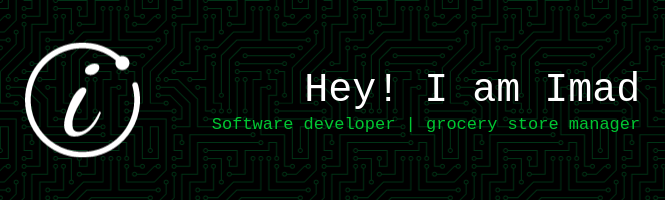

<!--  -->

<!-- ### Hi there 👋 -->

# Hello World!, 

Hey there, My name is imad a grocery store manager from Morocco I spend my whole day working in store, practically every day, but am also experimenting with HTML, CSS, and JavaScript; dabbling with Python and Go | Learning Dev and Linux | Enjoying life and making the most out of it.

# 💻Tech Stack

                     

# 📊GitHub Stats :

 
 

### ✍️Random Dev Quote

### 😂Random Dev Meme

---

## 💰You can help me out by Donating

   

  <!-- Proudly created with GPRM ( https://gprm.itsvg.in ) -->

